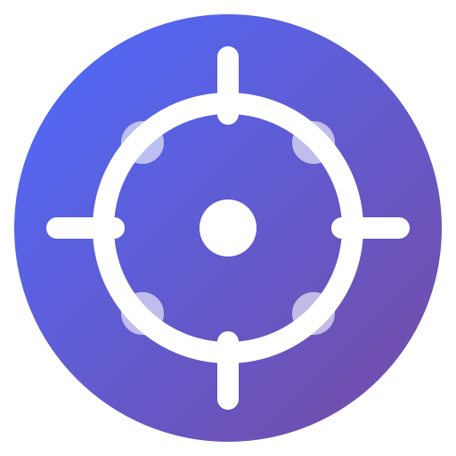

# DeepSeek Agent Monorepo

<div align="center">
  
  <h3>让 AI 成为你的专属编程助手</h3>
  <p>本地文件访问 & 命令执行</p>
</div>

---

## 项目结构

这是一个单体仓库（Monorepo），包含以下组件：

```
deepseek-agent/
├── desktop/           # Electron 桌面应用
│   ├── src/
│   │   ├── main/      # 主进程（文件操作、命令执行、WebSocket）
│   │   ├── preload/   # 预加载脚本
│   │   └── renderer/  # React UI
│   └── ...
├── extension/         # 浏览器插件
│   ├── content.js     # 内容脚本
│   ├── styles.css     # 样式
│   └── ...
├── src/               # Next.js 网页展示
└── public/
```

## 组件说明

### 🖥️ 桌面应用 (`/desktop`)

Electron 应用，提供：
- WebSocket 服务（端口 3777）
- 文件系统访问
- Shell 命令执行
- 系统托盘集成

### 🧩 浏览器插件 (`/extension`)

浏览器扩展，提供：
- DeepSeek Chat 集成
- Agent 按钮注入
- 系统提示应用

### 🌐 网页展示 (`/src`)

Next.js 网站，提供：
- 项目介绍
- 下载链接
- 安装指南

## 快速开始

### 1. 下载桌面应用

前往 [Releases](https://github.com/DingDing-bbb/deepseek-agent/releases) 下载对应平台的安装包。

### 2. 安装浏览器插件

```bash
# 克隆仓库
git clone https://github.com/DingDing-bbb/deepseek-agent.git
cd deepseek-agent

# 插件在 extension 目录
# 在浏览器中加载此目录
```

### 3. 开始使用

1. 启动桌面应用
2. 选择工作目录
3. 访问 [chat.deepseek.com](https://chat.deepseek.com)
4. 点击 Agent 按钮

## 开发

### 桌面应用

```bash
cd desktop
pnpm install
pnpm dev
```

### 网页

```bash
bun install
bun run dev
```

## 构建发布

创建 tag 会自动触发 GitHub Actions 构建：

```bash
git tag v1.0.0
git push origin v1.0.0
```

## 技术栈

- **桌面应用**: Electron + React + TypeScript
- **浏览器插件**: Chrome Extension Manifest V3
- **网页**: Next.js + Tailwind CSS + shadcn/ui
- **通信**: WebSocket

## 许可证

MIT License
